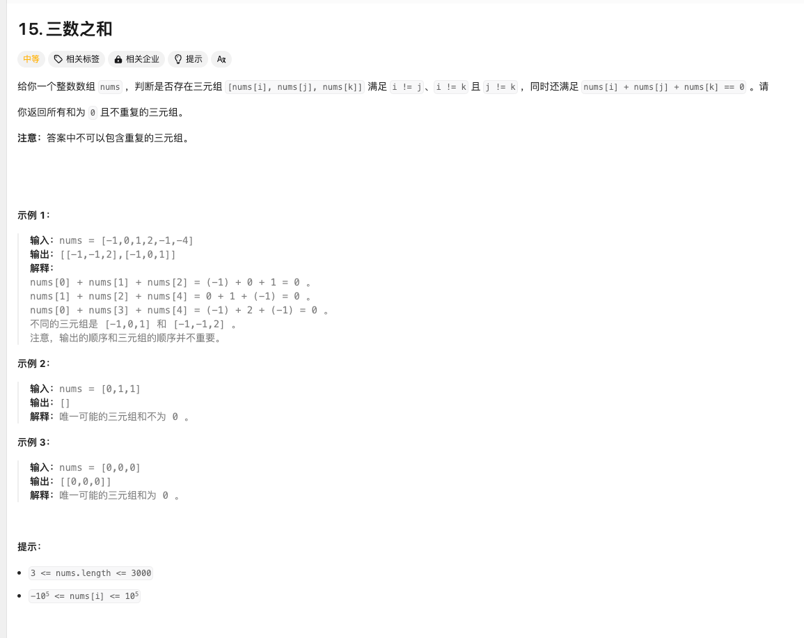

给你一个整数数组 nums ，判断是否存在三元组 [nums[i], nums[j], nums[k]] 满足 i != j、i != k 且 j != k ，同时还满足 nums[i] + nums[j] + nums[k] == 0 。请

你返回所有和为 0 且不重复的三元组。

注意：答案中不可以包含重复的三元组。

示例 1：

输入：nums = [-1,0,1,2,-1,-4]
输出：[[-1,-1,2],[-1,0,1]]
解释：
nums[0] + nums[1] + nums[2] = (-1) + 0 + 1 = 0 。
nums[1] + nums[2] + nums[4] = 0 + 1 + (-1) = 0 。
nums[0] + nums[3] + nums[4] = (-1) + 2 + (-1) = 0 。
不同的三元组是 [-1,0,1] 和 [-1,-1,2] 。
注意，输出的顺序和三元组的顺序并不重要。
示例 2：

输入：nums = [0,1,1]
输出：[]
解释：唯一可能的三元组和不为 0 。
示例 3：

输入：nums = [0,0,0]
输出：[[0,0,0]]
解释：唯一可能的三元组和为 0 。

提示：

3 <= nums.length <= 3000
-105 <= nums[i] <= 105

总结
1.先对数组从小到大排序，再使用双指针；
2.从0开始遍历数组，遍历到倒数第三个（nums.length-2），因为相加需要三个数，遍历的i，为最左侧，也就是最小的数字
3.for循环内部，定义双指针，start = i+1; end = nums.length-1; start为i后面一个元素，end是最后一个元素
4.用一个while(start < end)循环，里面用if判断是否有num[i] + num[start]+nums[end]为0的
- 如果有等于0，则start++, end--，如果++或者--遇到了一样的元素，则需要再++或者--，直到不一样位置
- 如果小于0，说明左侧的数字太小了，start需要往后挪成更大的
- 如果大于0，则end需要往左挪成小的